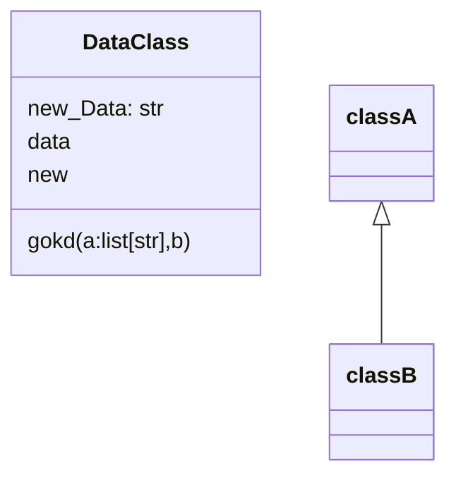
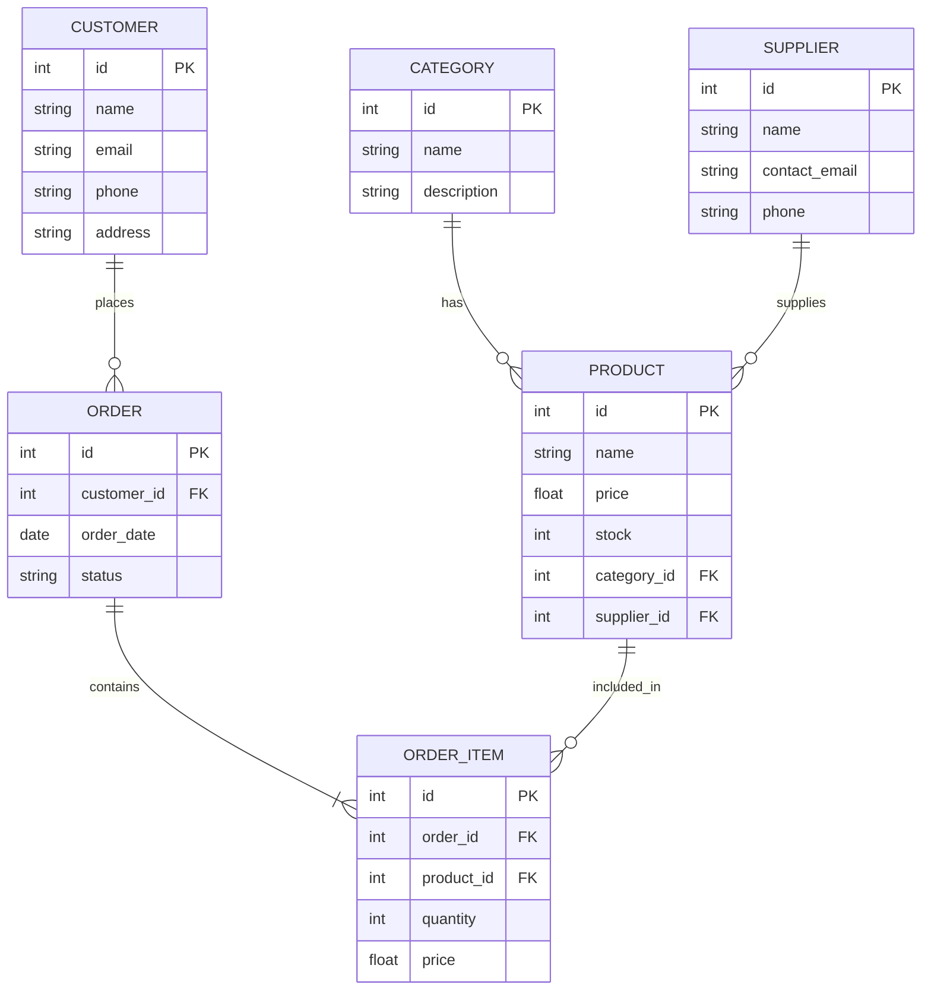

## hello

mermaid Example:

```mermaid
classDiagram
class DataClass{
    new_Data: str
    data
    new
    gokd(a:list[str],b)
}


classA <|-- classB

```

```mermaid
erDiagram

    CATEGORY ||--o{ PRODUCT : has
    SUPPLIER ||--o{ PRODUCT : supplies
    CUSTOMER ||--o{ ORDER : places
    ORDER ||--|{ ORDER_ITEM : contains
    PRODUCT ||--o{ ORDER_ITEM : included_in

    CATEGORY {
        int id PK
        string name
        string description
    }

    SUPPLIER {
        int id PK
        string name
        string contact_email
        string phone
    }

    PRODUCT {
        int id PK
        string name
        float price
        int stock
        int category_id FK
        int supplier_id FK
    }

    CUSTOMER {
        int id PK
        string name
        string email
        string phone
        string address
    }

    ORDER {
        int id PK
        int customer_id FK
        date order_date
        string status
    }

    ORDER_ITEM {
        int id PK
        int order_id FK
        int product_id FK
        int quantity
        float price
    }
```