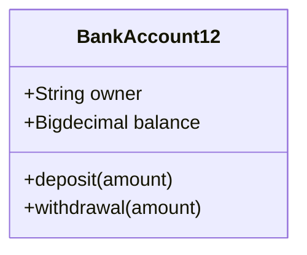
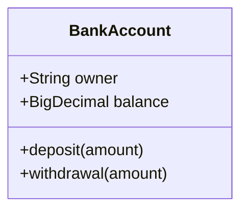
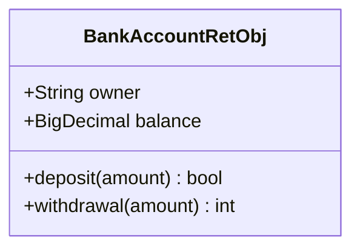
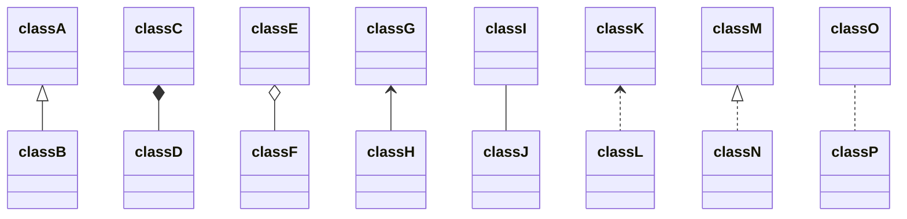
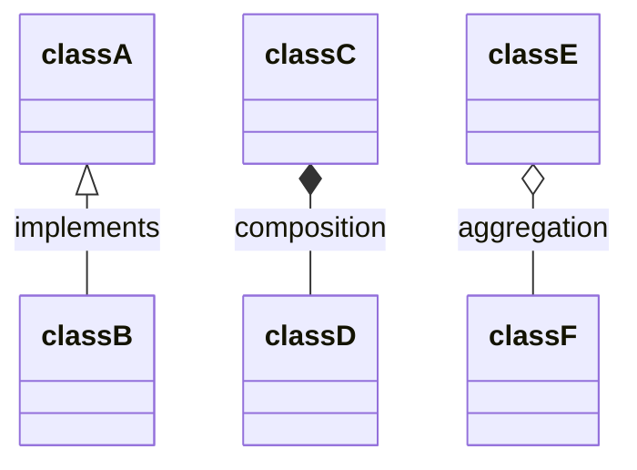
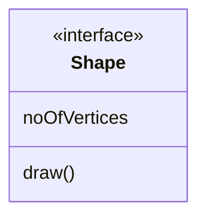
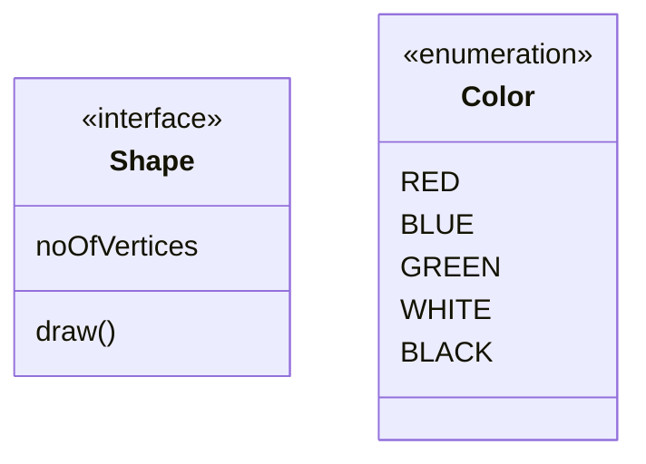
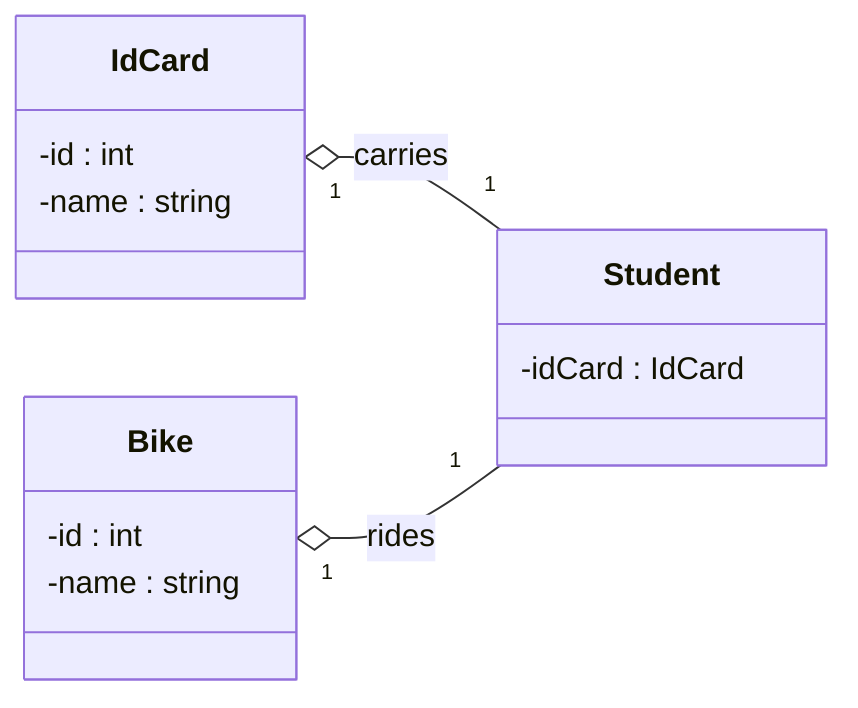

### Defining the Class
- Mehtod 1

### Method 2 : Using `{} brackets`

with type hinting




### Defining Relationship
```
[classA][Arrow][ClassB]
```
```
| Symbol | Type          | Description        |
|--------|--------------|--------------------|
| `<|--` | Inheritance  | Generalization     |
| `*--`  | Composition  | Strong ownership   |
| `o--`  | Aggregation  | Weak ownership     |
| `-->`  | Association  | Relationship       |
| `--`   | Link (Solid) | Solid line link    |
| `..>`  | Dependency   | Uses relationship  |
| `..|>` | Realization  | Implements         |
| `..`   | Link (Dashed)| Dashed line link   |
```

### Labels on Relations
```
[classA][Arrow][ClassB]:LabelText
```



### Annotations on classes

- `<<Interface>>` To represent an Interface class
- `<<Abstract>>` To represent an abstract class
- `<<Service>>` To represent a service class
- `<<Enumeration>>` To represent an enum


```

classDiagram
  class Shape <<interface>>

```



### Setting the direction of the diagram

