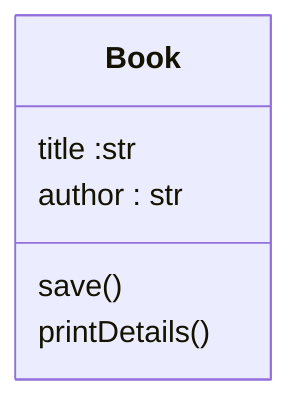
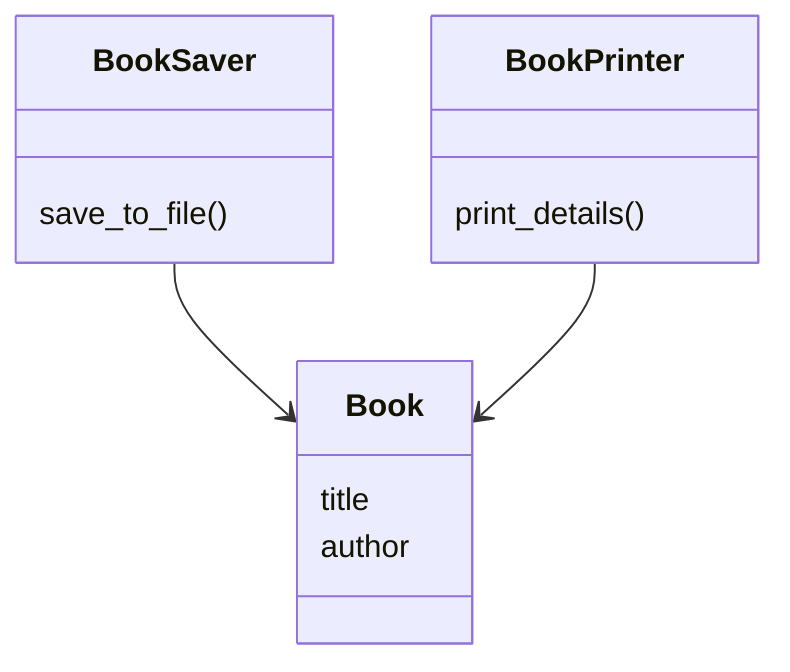
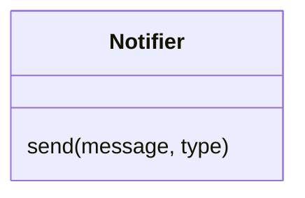
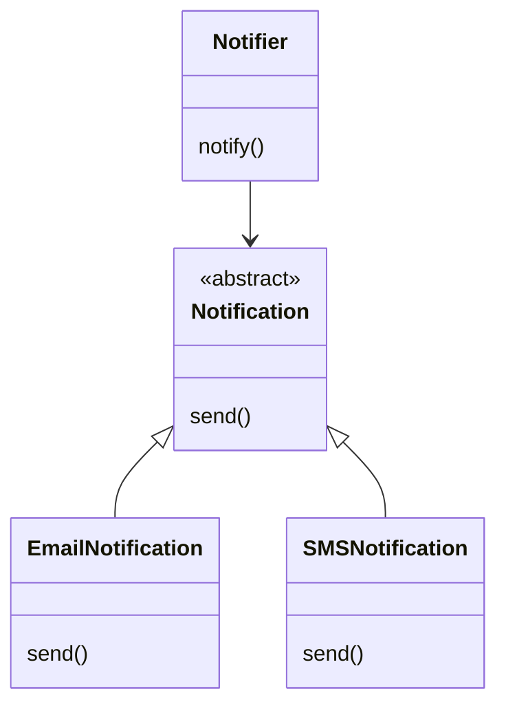
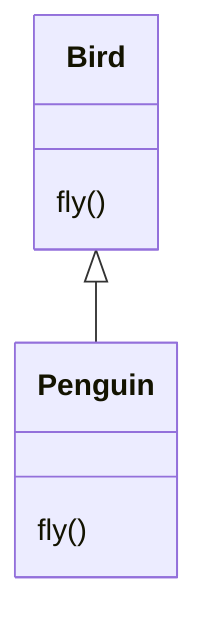
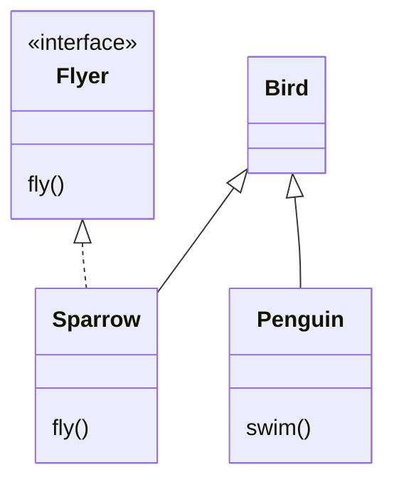
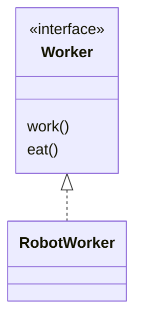
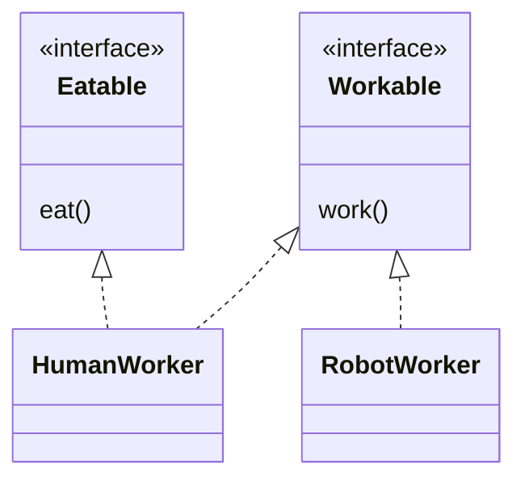
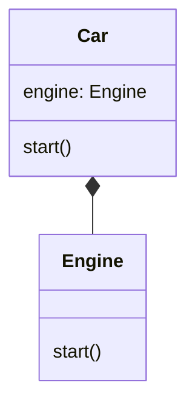
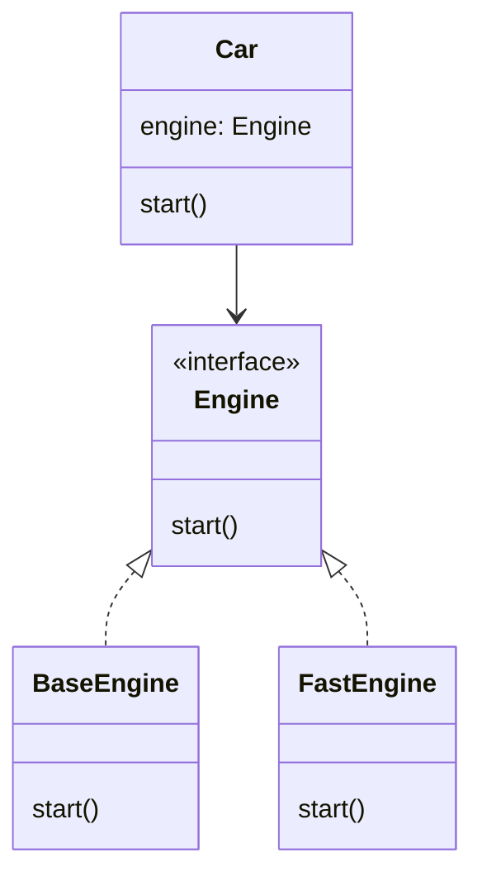

import Tabs from '@theme/Tabs';
import TabItem from '@theme/TabItem';


- Single Responsibility Principle (SRP)
- Open/Closed Principle (OCP)
- Liskov Substitution Principle (LSP)
- Interface Segregation Principle (ISP)
- Dependency Inversion Principle (DIP)


## Single Responsibility Principle (SRP)
- Software entities (classes, modules, functions, etc.) should have only one reason to change
- Software entities (classes, modules, functions, etc.) should have only one responsibility
#### ❌ Violating SRP

<Tabs>
<TabItem value="uml" label="UML">


</TabItem>

<TabItem value="python" label="Python">

```py
class Book:
    def __init__(self, title, author):
        self.title = title
        self.author = author
    
    def save(self): #Expected to change
        with open("books.txt", "a") as file:
            file.write(f"{book.title} by {book.author}\n")
    def printDetails(self): # no changes to expected
        print(f"Title: {book.title}, Author: {book.author}")
```
</TabItem>
</Tabs>


#### ✅ Applying SRP 
We can break the above code into smaller, unique classes.

<Tabs>
<TabItem value="uml" label="UML">



</TabItem>

<TabItem value="python" label="Python">

```py
# Book class: only responsible for holding data
class Book:
    def __init__(self, title, author):
        self.title = title
        self.author = author


# BookSaver class: responsible for saving data
class BookSaver:
    def save_to_file(self, book: Book):
        with open("books.txt", "a") as file:
            file.write(f"{book.title} by {book.author}\n")


# BookPrinter class: responsible for displaying data
class BookPrinter:
    def print_details(self, book: Book):
        print(f"Title: {book.title}, Author: {book.author}")

#### Usage
book = Book("1984", "George Orwell")

saver = BookSaver()
saver.save_to_file(book)

printer = BookPrinter()
printer.print_details(book)
```
</TabItem>
</Tabs>


### Open/Closed Principle (OCP)
- software entities (such as classes, modules, and functions) should be open for extension but closed for modification. 
- This can be achieved through techniques such as abstraction, inheritance, and polymorphism

- `Open for extension:` You should be able to add new functionality to your code.
- `Closed for modification:` You should not have to change the existing code to add that new functionality.

#### Best Practices for Implementing OCP
- `Use Abstraction:` Define abstract classes or interfaces to represent common behaviors and allow for different implementations. 
- `Leverage Polymorphism:` Use polymorphism to enable different implementations to be used interchangeably. 
- `Avoid Tight Coupling:` Design your classes to be loosely coupled, making it easier to extend functionality without modifying existing code. 
- `Follow Design Patterns:` Utilize design patterns such as Strategy, Template Method, and Visitor to implement the Open/Closed Principle effectively. 

#### ❌ Violating OCP
<Tabs>
<TabItem value="uml" label="UML">


</TabItem>

<TabItem value="python" label="Python">

```py
class Notifier:
    def send(self, message, type):
        if (type == "email"):
            print(f"Sending email: {message}")
        elif (type == "sms"):
            print(f"Sending SMS: {message}")
```
</TabItem>
</Tabs>


#### ✅ Applying OCP

<Tabs>
<TabItem value="uml" label="UML">


</TabItem>

<TabItem value="python" label="Python">

```py
from abc import ABC, abstractmethod

# Base interface (abstract class)
class Notification(ABC):
    @abstractmethod
    def send(self, message):
        pass


# Concrete implementations
class EmailNotification(Notification):
    def send(self, message):
        print(f"Sending email: {message}")


class SMSNotification(Notification):
    def send(self, message):
        print(f"Sending SMS: {message}")


# Notifier class (closed for modification, open for extension)
class Notifier:
    def notify(self, notification: Notification, message):
        notification.send(message)

#### Usage
notifier = Notifier()

email = EmailNotification()
sms = SMSNotification()

notifier.notify(email, "Welcome to our service!")
notifier.notify(sms, "Your code is 1234")


# Adding a new type without modifying existing code
class PushNotification(Notification):
    def send(self, message):
        print(f"Sending push notification: {message}")


push = PushNotification()
notifier.notify(push, "You have a new alert!")
```
</TabItem>
</Tabs>

ref  : Strategy Pattern and factory patten

### Liskov Substitution Principle (LSP)
Liskov Substitution Principle suggests a subclass should work anywhere its parent class works, without causing problems.
`Subtypes must be substitutable for their base types.`
:::info
if S is a subtype of T, then objects of type T may be replaced by objects of type S, without breaking the program.
:::


#### ❌ Violating LSP
<Tabs>
<TabItem value="uml" label="UML">


</TabItem>

<TabItem value="python" label="Python">

```py
class Bird:
    def fly(self):
        print("This bird is flying.")
class Penguin:
    def fly(self):
        raise Exception("Cannot fly.")
```
</TabItem>
</Tabs>

#### ✅ Applying LSP

<Tabs>
<TabItem value="uml" label="UML">


</TabItem>

<TabItem value="python" label="Python">

```py
from abc import ABC, abstractmethod

# Base class (no assumption about flying)
class Bird(ABC):
    pass


# Separate interface for flying behavior
class Flyer(ABC):
    @abstractmethod
    def fly(self):
        pass


# Sparrow can fly → implements Flyer
class Sparrow(Bird, Flyer):
    def fly(self):
        print("Sparrow is flying.")


# Penguin cannot fly → does not implement Flyer
class Penguin(Bird):
    def swim(self):
        print("Penguin is swimming.")


# Function that only works with flying objects
def let_fly(flyer: Flyer):
    flyer.fly()


# Usage
sparrow = Sparrow()
let_fly(sparrow)

penguin = Penguin()
penguin.swim()
```
</TabItem>
</Tabs>


## Interface Segregation Principle (ISP):
Client should not be forced to depend on methods they don't use
This principle means a class should not be forced to depend on methods it does not need. Instead of creating one large interface that tries to cover everything, it is better to break it down into smaller, focused interfaces.


Mehthod signature rule:
1. Contravaariance of arguments (
-if subtype equal no of arg in override method(no of arg in super = subtype)
-DONT MAKE SUBCLASS METHODS ARG MORE SPECIFIC)
covariance of result:
-Overrideen method returns a result if and only if the parent method does too
--DONT MAKE SUBCLASS METHODS return types more general!
Exception rule
- dont thorw new types of exceptions from subclasses


pre=condition rule
post-condition rule
Invariant rule
Constaint rule


#### ❌ Violating ISP

<Tabs>
<TabItem value="uml" label="UML">


</TabItem>

<TabItem value="python" label="Python">

```py
from abc import ABC, abstractmethod

class Worker(ABC):
    @abstractmethod
    def work(self):
        pass

    @abstractmethod
    def eat(self):
        pass


class RobotWorker(Worker):
    def work(self):
        print("Robot working")

    def eat(self):
        raise Exception("Robot cannot eat")
```

</TabItem>
</Tabs>

#### ✅ Applying ISP
<Tabs>
<TabItem value="uml" label="UML">


</TabItem>

<TabItem value="python" label="Python">

```py

from abc import ABC, abstractmethod
class Worker(ABC):
    @abstractmethod
    def work():
        pass
class Eatable(ABC):
    @abstractmethod
    def eat():
        pass

class HumanWorker(Workable, Eatable):
    def work():
        print("Human is working.")
    

    def eat() :
        print("Human is eating.")


class RobotWorker(Workable):
    def work() 
        print("Robot is working.")
# Usage
human = new HumanWorker()
robot = new RobotWorker()

human.work()
human.eat()
robot.work()

```
</TabItem>
</Tabs>

No class is forced to depend on methods it doesn’t need. The design is cleaner and follows the Interface Segregation Principle.

Principle 5. Dependency inversion principle
This principle explains that high-level components of the code should not rely on low-level components. Both should rely on abstractions instead. It helps decouple components of a system so they can change independently without causing damage to each other.

#### ❌ Violating DIP

<Tabs>
<TabItem value="uml" label="UML">


</TabItem>

<TabItem value="python" label="Python">

```py
class Engine:
	def start(self):
		print("Engine Started")
		
class Car:
	def __init__(self):
		self.engine = Engine()
	def start(self):
		self.engine.start()
		print("car started")
	
car = Car()
car.start()
```
</TabItem>
</Tabs>

### ✅ Applying DIP

<Tabs>
<TabItem value="uml" label="UML">



</TabItem>

<TabItem value="python" label="Python">

```py
class Engine(ABC):
	@abstractmethod
	def start()

class BaseEngine(Engine)
    def start(self):
		print("Base Engine Started")
class FastEngine(Engine):
	def start(self):
		print("Fast Engine Started")
		
		
class Car:
	def __init__(self,engine:Engine):
		self.engine = engine
	def start(self):
		self.engine.start()
		print("car started")
        
# Usage		
fastEngine = FastEngine()

car = Car(fastEngine)
car.start()
```
</TabItem>
</Tabs>


|Principle 	| Description |
|--------|-------|
|Single Responsibility Principle (SRP) | 	A class should have only one reason to change, or in other words, it should have a single responsibility. |
|Open/Closed Principle (OCP) 	Software | entities should be open for extension but closed for modification. |
|Liskov Substitution Principle (LSP) | 	Subtypes must be substitutable for their base types without altering the correctness of the program. |
|Interface Segregation Principle (ISP) | 	Clients should not be forced to depend on interfaces they do not use. |
|Dependency Inversion Principle (DIP) | 	High-level modules should not depend on low-level modules; both should depend on abstractions. Abstractions should not depend on details, but details should depend on abstractions.|


