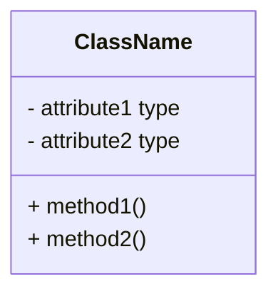
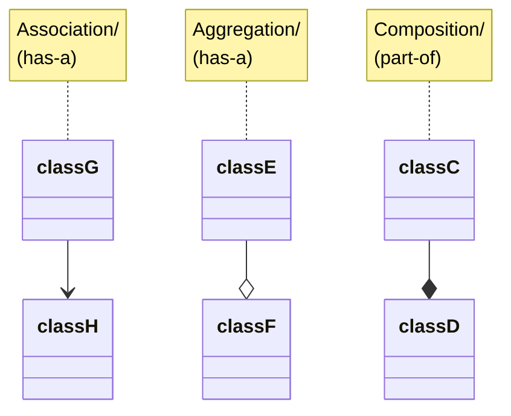
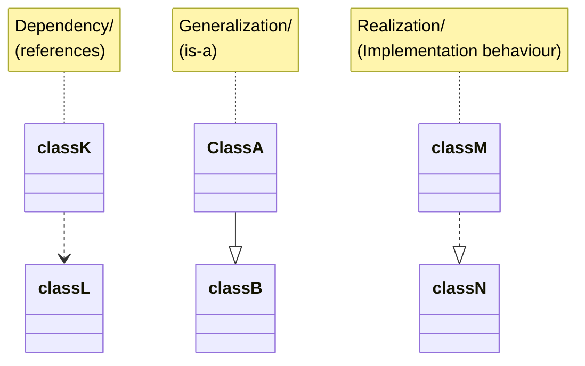
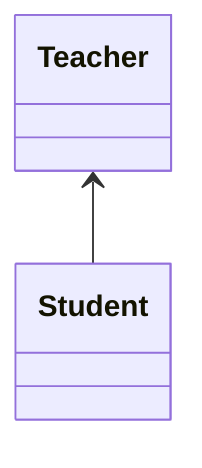
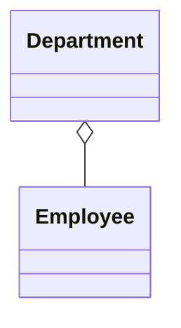
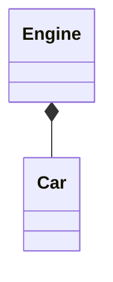
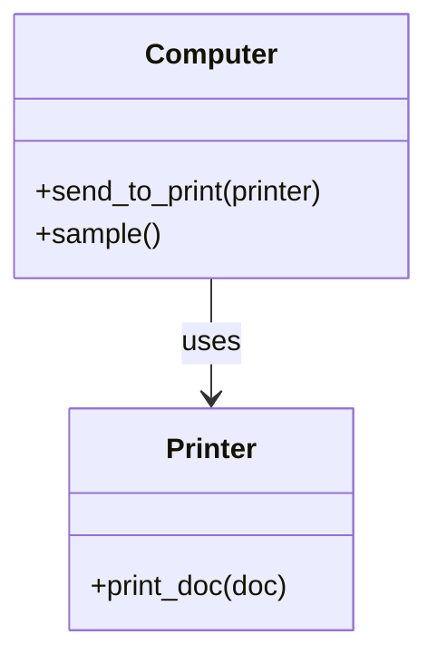
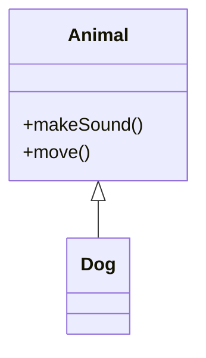
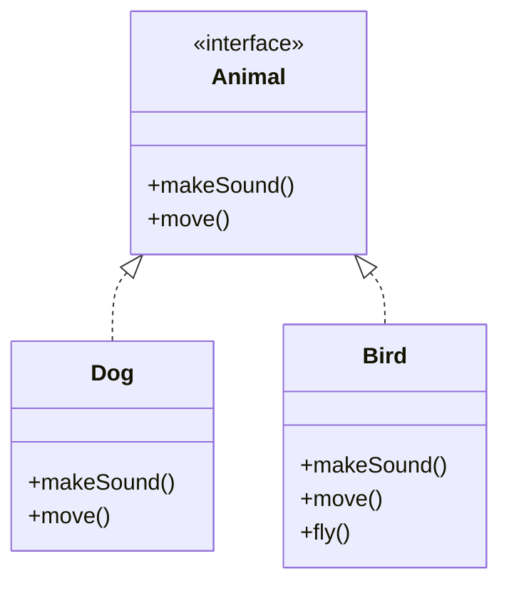
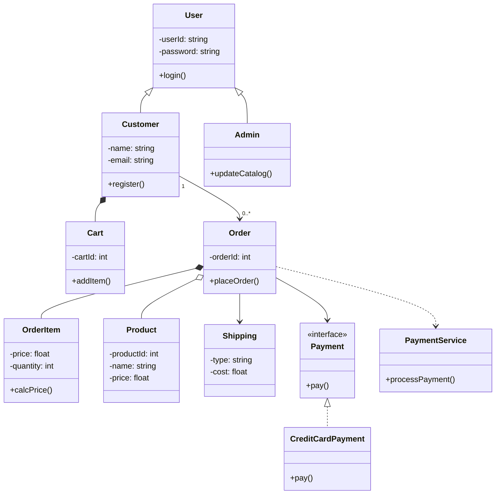

import Tabs from '@theme/Tabs';
import TabItem from '@theme/TabItem';


## 📊  Basic Class Structure



## 🔐  Visibility (Access Modifiers)
| UML Symbol | Meaning   | Python Equivalent   |
| ---------- | --------- | ------------------- |
| `+`        | Public    | `self.name`         |
| `-`        | Private   | `_name` or `__name` |
| `#`        | Protected | `_name`             |

## UML Relationship



## 1️⃣ Association (simple relationship)


<Tabs>
<TabItem value="uml" label="UML">


</TabItem>

<TabItem value="python" label="Python">

```py
class Teacher:
    def __init__(self, name):
        self.name = name

class Student:
    def __init__(self, name, teacher):
        self.name = name
        self.teacher = teacher  # association

t1 = Teacher("John")
s1 = Student("Alice", t1)

print(s1.teacher.name)  # John
```
</TabItem>
</Tabs>

```
Association
   ├── Aggregation (weak “has-a”)
   └── Composition (strong “has-a”)
```

## 2️⃣ Aggregation (weak "has-a")
👉 One class contains another, but can exist independently
Definition:


<Tabs>
<TabItem value="uml" label="UML">


</TabItem>

<TabItem value="python" label="Python">

```py
class Department:
    def __init__(self, name):
        self.name = name

class Employee:
    def __init__(self, name, department):
        self.name = name
        self.department = department  # aggregation

dept = Department("HR")
emp = Employee("Alice", dept)

print(emp.department.name)  # HR

```
</TabItem>
</Tabs>


## 3️⃣ Composition (strong "has-a")
Definition:
A strong relationship where the child object cannot exist without the parent.


<Tabs>
<TabItem value="uml" label="UML">


</TabItem>

<TabItem value="python" label="Python">

```py
class Engine:
    def __init__(self):
        self.type = "Petrol"

class Car:
    def __init__(self):
        self.engine = Engine()

car = Car()
print(car.engine.type)  # Petrol
```
</TabItem>
<TabItem value='example2' label="Example">
```py
class Room:
    def __init__(self, name):
        self.name = name

class House:
    def __init__(self):
        self.rooms = [Room("Bedroom"), Room("Kitchen")]
# 👉 Rooms are created inside House → strong dependency
# Room exists only inside House
# 👉 If House is deleted → Rooms also go
```
</TabItem>
</Tabs>


## 4️⃣ Dependency (Uses Temporarily)
Definition:
One class uses another temporarily, usually as a method parameter.


<Tabs>
<TabItem value="uml" label="UML">


</TabItem>

<TabItem value="python" label="Python">

```py
class Printer:
    def print_doc(self, doc):
        print(f"Printing {doc}")

class Computer:
    def send_to_print(self, printer):
        printer.print_doc("Report") 
    def sample(self):
        print("hello")

printer = Printer()
pc = Computer()

pc.send_to_print(printer)
```
</TabItem>
</Tabs>


## 5️⃣ Generalization (Inheritance)

## 6️⃣ Realization (Interface Implementation)


## 🔢  Multiplicity
```
| Symbol | Meaning      |
| ------ | ------------ |
| `1`    | Exactly one  |
| `0..1` | Optional     |
| `0..*` | Many         |
| `1..*` | At least one |
```


## 🔥 Quick Comparison Table

| Type                          | Strength | Lifetime     | Direction / Relationship Type      | Example Meaning              | Python Representation        |
|-------------------------------|----------|--------------|------------------------------------|------------------------------|------------------------------|
| Association `───▶`            | Medium   | Independent  | One-way / Two-way (general)        | Student ↔ Teacher            | Reference (attribute)        |
| Aggregation `◇`               | Weak     | Independent  | Weak "has-a"                       | Employee has Department      | List / Reference             |
| Composition `◆`               | Strong   | Dependent    | Strong "has-a" (owns-a)            | Car has Engine               | Object created inside class  |
| Dependency                    | Weak     | Temporary    | Uses                               | Computer uses Printer        | Method parameter             |
| Generalization `▲` (Inheritance) | Strong   | Permanent    | IS-A                               | Dog is an Animal             | `class Dog(Animal)`          |
| Realization (Interface)       | Strong   | Permanent    | Implements                         | Class implements interface   | ABC / Interface subclass     |


## 🧩 Full Real-World UML (ALL concepts included)


<Tabs>
<TabItem value="uml" label="UML">


</TabItem>

<TabItem value="python" label="Python">

```py


from abc import ABC, abstractmethod


# =========================
# INTERFACE (Realization)
# =========================
class Payment(ABC):
    @abstractmethod
    def pay(self, amount):
        pass


class CreditCardPayment(Payment):
    def pay(self, amount):
        print(f"[Payment] Paid ₹{amount} using Credit Card")


class UpiPayment(Payment):
    def pay(self, amount):
        print(f"[Payment] Paid ₹{amount} using UPI")


# =========================
# BASE CLASS (Inheritance)
# =========================
class User:
    def __init__(self, user_id, password):
        self.user_id = user_id
        self.password = password

    def login(self):
        print(f"[User] {self.user_id} logged in")


# =========================
# DERIVED CLASSES
# =========================
class Customer(User):
    def __init__(self, user_id, password, name, email):
        super().__init__(user_id, password)
        self.name = name
        self.email = email

        # COMPOSITION → Cart belongs to Customer
        self.cart = Cart()

    def register(self):
        print(f"[Customer] {self.name} registered")

    def update_profile(self):
        print(f"[Customer] {self.name}'s profile updated")


class Admin(User):
    def __init__(self, user_id, password, admin_name):
        super().__init__(user_id, password)
        self.admin_name = admin_name

    def update_catalog(self):
        print(f"[Admin] {self.admin_name} updated catalog")


# =========================
# PRODUCT (Independent Entity)
# =========================
class Product:
    def __init__(self, product_id, name, price):
        self.product_id = product_id
        self.name = name
        self.price = price


# =========================
# ORDER ITEM (Composition inside Order)
# =========================
class OrderItem:
    def __init__(self, product: Product, quantity):
        self.product = product
        self.quantity = quantity

    def calc_price(self):
        return self.product.price * self.quantity


# =========================
# CART (Composition)
# =========================
class Cart:
    def __init__(self):
        self.items = []

    def add_item(self, product: Product, quantity):
        item = OrderItem(product, quantity)
        self.items.append(item)
        print(f"[Cart] Added {product.name} (x{quantity})")

    def remove_item(self, product_id):
        self.items = [i for i in self.items if i.product.product_id != product_id]
        print(f"[Cart] Removed product {product_id}")

    def view_cart(self):
        print("\n[Cart] Items:")
        total = 0
        for item in self.items:
            price = item.calc_price()
            print(f" - {item.product.name} x{item.quantity} = ₹{price}")
            total += price
        print(f"Total = ₹{total}")
        return total


# =========================
# SHIPPING
# =========================
class Shipping:
    def __init__(self, shipping_type, cost):
        self.shipping_type = shipping_type
        self.cost = cost

    def update_shipping(self):
        print(f"[Shipping] Updated {self.shipping_type} shipping")


# =========================
# PAYMENT SERVICE (Dependency)
# =========================
class PaymentService:
    def process_payment(self, payment: Payment, amount):
        print("[PaymentService] Processing payment...")
        payment.pay(amount)


# =========================
# ORDER (Core Entity)
# =========================
class Order:
    def __init__(self, order_id, customer: Customer):
        self.order_id = order_id
        self.customer = customer

        # COMPOSITION → Order owns OrderItems
        self.items = []

        # ASSOCIATION
        self.shipping = None

        # INTERFACE reference
        self.payment_method = None

    def add_items_from_cart(self):
        self.items = self.customer.cart.items.copy()
        print(f"[Order] {len(self.items)} items added from cart")

    def set_shipping(self, shipping: Shipping):
        self.shipping = shipping

    def set_payment_method(self, payment: Payment):
        self.payment_method = payment

    def calculate_total(self):
        total = sum(item.calc_price() for item in self.items)
        if self.shipping:
            total += self.shipping.cost
        return total

    def place_order(self, payment_service: PaymentService):
        print(f"\n[Order] Placing Order #{self.order_id}")

        total = self.calculate_total()
        print(f"[Order] Total Amount = ₹{total}")

        # DEPENDENCY
        payment_service.process_payment(self.payment_method, total)

        print("[Order] Order placed successfully!")


# =========================
# MAIN EXECUTION (Demo)
# =========================
if __name__ == "__main__":
    # Create customer
    customer = Customer("U101", "pass123", "Arun", "arun@email.com")
    customer.login()
    customer.register()

    # Create products
    p1 = Product(1, "Laptop", 50000)
    p2 = Product(2, "Mouse", 500)

    # Add to cart
    customer.cart.add_item(p1, 1)
    customer.cart.add_item(p2, 2)

    customer.cart.view_cart()

    # Create order
    order = Order(1001, customer)
    order.add_items_from_cart()

    # Set shipping
    shipping = Shipping("Express", 200)
    order.set_shipping(shipping)

    # Choose payment method
    payment_method = UpiPayment()
    order.set_payment_method(payment_method)

    # Payment service
    payment_service = PaymentService()

    # Place order
    order.place_order(payment_service)
```
</TabItem>
</Tabs>


