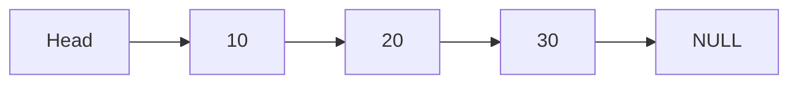
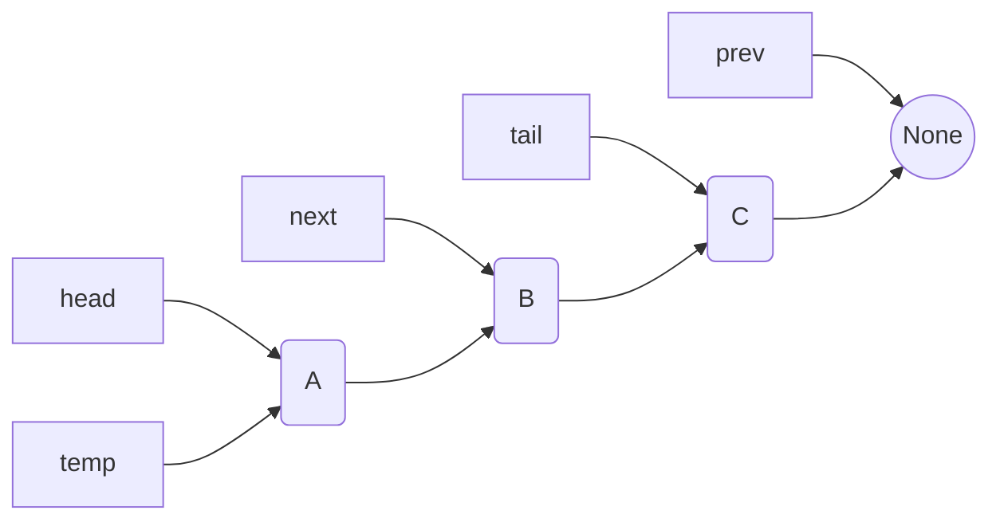
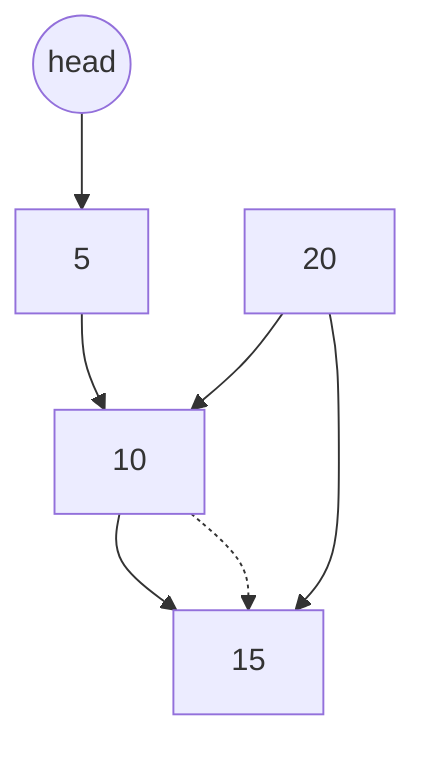
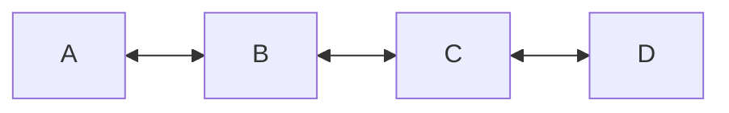
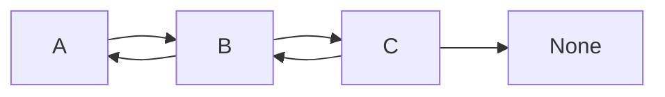
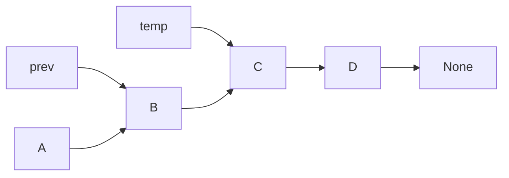

#### Ref Python_Day_3.2 dictionary.ipynb









| Shape                | Syntax  | Example |
| -------------------- | ------- | ------- |
| Rectangle            | `[A]`   | A[A]    |
| Round / Circle edges | `(A)`   | A(A)    |
| Circle               | `((A))` | A((A))  |
| Stadium / rounded    | `([A])` | A([A])  |










```mermaid

flowchart LR

prev --> B
temp --> C
newNode --> D

A --> B --> C --> None