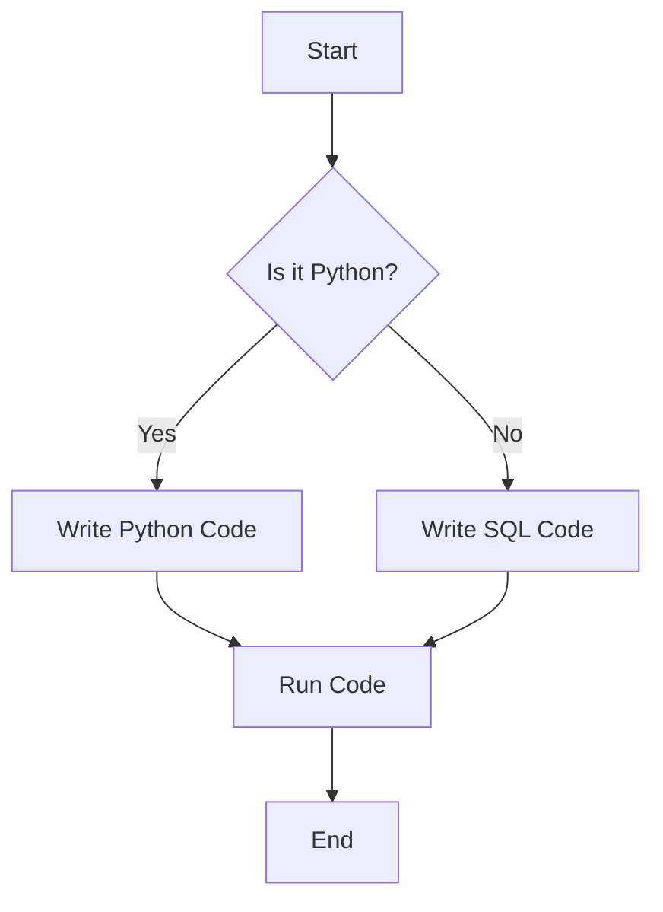

# this is python


# Full Documentation Template

Welcome to your **professional Docusaurus documentation template**!  
This template demonstrates most of the advanced Markdown features supported by Docusaurus.

---

## Overview

This page includes:

- Tabs for multiple programming languages
- Nested tabs
- Collapsible sections
- Tables
- Admonitions
- Images and links
- Code examples

---


## 4️⃣ Flowchart Example


5️⃣
---

## 5️⃣ Expandable / Collapsible Section

<details>
  <summary>Click to see Python List Example</summary>

```python
numbers = [1, 2, 3, 4, 5]
squared = [n**2 for n in numbers]
print(squared)
```

</details>

<details>
  <summary>Click to see SQL Join Example</summary>

```sql
SELECT u.id, u.name, o.order_id
FROM users u
JOIN orders o ON u.id = o.user_id
WHERE o.amount > 100;
```

</details>

---

## 6️⃣ Code Highlighting with Tabs (Python & SQL)

import Tabs from '@theme/Tabs';
import TabItem from '@theme/TabItem';

<Tabs>
  <TabItem value="python" label="Python">
```python
def add(a, b):
    return a + b

print(add(5, 3))
```
  </TabItem>

  <TabItem value="sql" label="SQL">
```sql
SELECT SUM(amount) AS total
FROM orders
WHERE status = 'completed';
```
  </TabItem>
</Tabs>

---


## 8️⃣ Bonus: Checklist Table Example

| Task                | Status  | Notes |
|--------------------|---------|-------|
| Write Python script | ✅      | Tested successfully |
| Write SQL query     | ✅      | Optimized with indexes |
| Create Flowchart    | ⚪      | Use Mermaid |
| Add Tabs in MDX     | ⚪      | For multi-language examples |
